# Blue/Green Switcher
## 概要

- バックボーンネットワークでも Blue/Green デプロイメントがしたい！
    - 2 面の バックボーンネットワークを用意する
    - Blue をユーザが利用しているときは Green を開発する
    - Green の開発が終わったら Green を主系に切り替え，ユーザトラフィックを流す
    - 問題が起きたらすぐに Blue に切り戻す
    - うまく行ったら今度は Blue で開発を行い，開発が終わったら切り替える
    - AS の中 → 外，外 → 中，トランジット，全ての通信でこれを行う
- 徐々に切り替えるのが本来だけど，今回はズバっと一気に切り替える

[設計資料](./memo/design.md)

[TODO](./memo/todo.md)

## 環境の起動
`make tinet-upconf`

## 環境の削除
`make tinet-down`